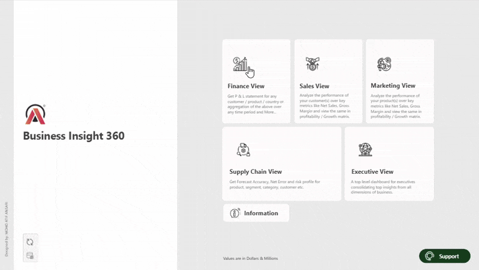
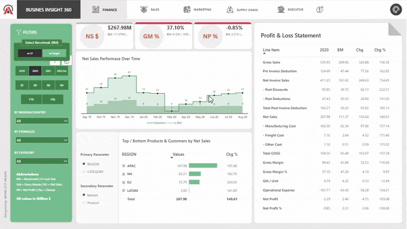
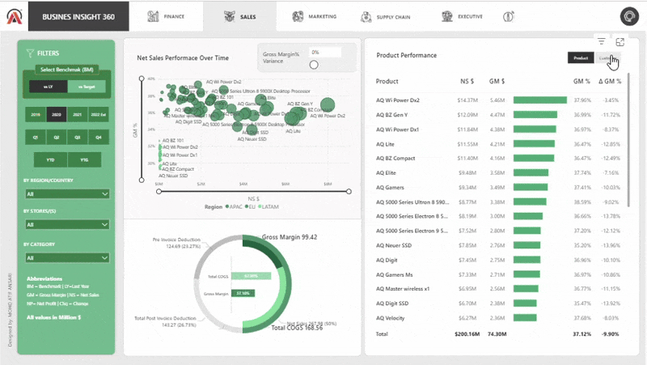
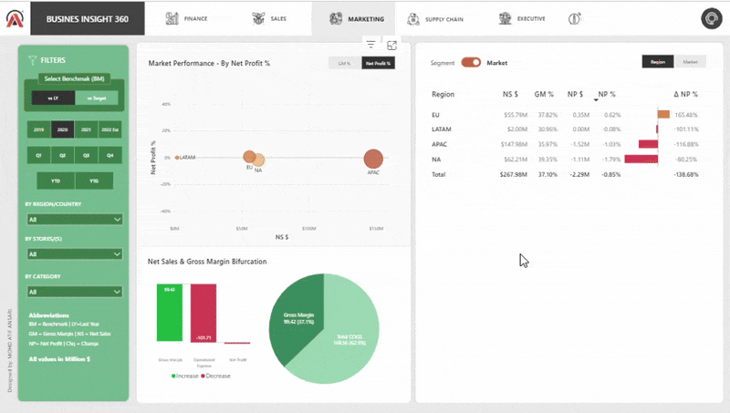
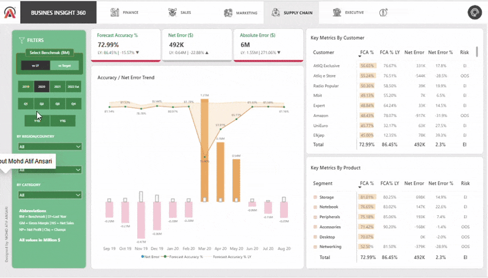
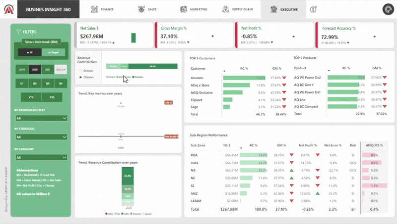

# 📊 Business Insights 360 — Data Analytics Project

## 🚀 Overview

AtliQ Hardware, a global computer hardware and accessories manufacturer, decided to implement **data analytics using Power BI** to make data-driven business decisions and stay ahead of competitors.
Previously, the company relied on Excel for analysis, but as the business expanded, top management wanted to build interactive dashboards and generate insights across departments — **Finance, Sales, Marketing, and Supply Chain** — using **SQL and Power BI**.
This project simulates a real-world business scenario where I acted as a **Data Analyst**, extracting insights from raw data, writing SQL queries, and designing an end-to-end Power BI dashboard following a structured analytics workflow.

🔗 **Live Dashboard Links**
---
## 🔹 Power BI Service: 
_https://app.powerbi.com/view?r=eyJrIjoiMWVhYTlkNmUtYTIyMy00ZjQ5LTljNzMtMzAwNDUyOTIzY2RiIiwidCI6ImM2ZTU0OWIzLTVmNDUtNDAzMi1hYWU5LWQ0MjQ0ZGM1YjJjNCJ9_

🧩 **Project Objectives**

- Provide actionable business insights to AtliQ’s management team.
- Build SQL queries and stored procedures to generate data-driven reports.
- Design a fully functional Power BI dashboard for decision-making across key business domains.
- Enable automation, interactivity, and data refresh pipelines for continuous insights.

## 🛠️ Tools Used
- SQL
- Power BI Desktop
- Excel
- DAX language
- DAX studio (for optimizing the report)

## 🧠 Workflow Summary
**Data Cleaning & Transformation**

- Implemented multiple data-cleaning steps and business rule validations.
- Designed an ETL pipeline to connect and transform data using Power Query in Power BI.

**Power BI Development**

- Connected Power BI to MySQL and Excel.
- Built a data model using Snowflake schema and performed data validation with benchmark values.
- Created calculated columns and measures using DAX.
- Designed dynamic dashboards for different departments with interactive visuals and slicers.
- Used Bookmarks, Toggle buttons, and Conditional formatting to enhance interactivity.
- Set up automatic data refresh through Power BI Gateway.
- Deployed and shared the final dashboard via Power BI Service for UAT and stakeholder review.

## Company’s background
AltiQ hardware is a company which has grown vastly in the recent years, and opened business all over the globe. It is a company which sells, computer and computer accessories through three mediums/channel

- Retailers
- Direct
- Distributors

Recently the company has faced a unforeseen loss by opening store in America based on the surveys, intuition and some excel analysis and also the company’s competitors has handful of analytics team to perform analysis and make data driven decision. So, the AltiQ hardware has no other option other than building their analytics team for data driven insights and decisions in the future to survive better in the industry.

Project kick off session, where you should get clear of for what and why this project and all other questions you have with regards to the project

## Questions to ask before starting with dashboard
- What is the objective of building this PowerBi dashboard?
- In what terms the success of this project will be measured?
- What will be time dead-line of the project?
- Do the stakeholders expecting pre-view before the actual release?
- What are all the hopes stakeholders have out of this project?
- What are all fears the stakeholder have in terms of building this dashboard?
- Who are all will be using this dashboard and for what purpose?
- What are all expectation the stakeholders have, by the completion of this project?
- What can go wrong while building this project?
- What are all the resources/ data needed to build this dashboard?
- Is there any inputs from stakeholders in terms of design and views of the dashboard?
  
After the project kick off meetings, the data engineering team has given the data as per the request of data analytics team, let’s explore them.

## Importing data into PowerBi
As the database is MySQL in this project, we need to import the datasets from Mysql database to PowerBi by providing the Database access credential

## 📈 Dashboard Views
## Home view
In Home view, all the views button will be available. User will land on specific view page by clicking the button

- Info
- Finance View
- Sales View
- Marketing View
- Supply chain View
- Executive View
- Stakeholder Request
- Support

## Overall Report

## 1️⃣ Finance View
**Purpose**: To track overall company profitability and financial performance.

**Key Features**:
Full Profit & Loss statement with metrics from Gross Sales → Net Profit.
KPIs: Net Sales, Gross Margin %, Net Profit %.
Dynamic comparison with Target or Last Year (LY).
Top/Bottom Products & Customers based on Net Sales.

👤 **Stakeholder**:
**Finance Managers** and **CFOs** use this view to monitor the company’s financial health, identify cost leakages, and ensure that revenue targets are met compared to benchmarks or last year’s performance.

## 2️⃣ Sales View

**Purpose**: To analyze sales performance and understand market dynamics.

**Key Features**:
Analysis of Unit Economics (Net Sales vs Discounts & COGS).
Product and Customer performance by Gross Margin % and Net Sales.
Market/Region/Customer performance matrix.
Trend tooltips for customer-level performance tracking.

👤 **Stakeholder**:
**Sales Heads** and **Regional Managers** rely on this view to evaluate sales performance, identify high or low-performing customers or products, and make data-driven decisions on pricing and discounts.

## 3️⃣ Marketing View

**Purpose**: To evaluate marketing expenses and their impact on profitability.

**Key Features**:
Tracks Operational Expenses and their effect on Net Profit.
Performance matrix by Segment, Category, and Product.
Dynamic toggle button to switch between Gross Margin and Net Profit perspectives.

👤 **Stakeholder**:
**Marketing Managers** use this dashboard to analyze the ROI of marketing campaigns, identify which product categories respond best to promotions, and align marketing spend with overall revenue goals.

## 4️⃣ Supply Chain View

**Purpose**: To measure inventory efficiency and forecast accuracy.

**Key Features**:
KPIs: Forecast Accuracy (FA%), Net Error, Absolute Error, and Risk Factor.
Accuracy vs Error trend analysis.
Product and Customer-level FA% tracking.

👤 **Stakeholder**:
**Supply Chain Analysts and Operations Managers** use this view to ensure inventory optimization, reduce stockouts/excess inventory, and improve demand forecasting accuracy.

## 5️⃣ Executive View

**Purpose**: To give top management a holistic company overview.

**Key Features**:
Market Share and Revenue analysis by Division and Channel.
Top 5 Products and Top 5 Customers by Revenue.
Sub-Zone revenue contribution insights.
Consolidated KPIs across Finance, Sales, Marketing, and Supply Chain.

👤 **Stakeholder**:
**Executives, Directors, and CXOs** use this view for high-level strategic decisions — comparing divisions, spotting growth opportunities, and monitoring company-wide performance trends in a single page.

## 💡 Key Insights
- **Finance**: Focused on Gross Margin and Net Profit as core profitability metrics.
- **Sales**: Net Sales and Gross Margin drive key performance trends.
- **Marketing**: Understanding changes in marketing spend and its revenue impact.
- **Supply Chain**: Forecast Accuracy and Inventory Risk are critical for efficiency.
- **Executive**: Multi-level view for quick decision-making across departments.

## 🧭 Domain Knowledge Gained
- **Finance**: Gross Margin, Net Profit, P&L metrics
- **Sales**: Discounts, COGS, Market/Customer segmentation
- **Marketing**: Campaign ROI and category profitability
- **Supply Chain**: Forecast accuracy, error metrics, inventory management

## ⚙️ DAX Functions Used
- CALCULATE()
- DIVIDE()
- FILTER()
- SWITCH()
- RELATED()
- SUMX()

## 🧩 Business related terms
- Gross price
- Pre-invoice deductions
- Post-Invoice deductions
- Net Invoice sale
- Gross Margin
- Net sales
- Net profit
- COGC - cost of goods sold
- YTD - Year to Date
- YTG - Year to Go
- Direct
- Retailer
- Distributors
- Consumer

## 📊 Project Outcomes
✅ Enabled data-driven decisions across departments

✅ Improved forecast accuracy and inventory management

✅ Enhanced visibility of financial and operational metrics

✅ Empowered management with a unified executive dashboard

## 📚 Learnings
- Importance of stakeholder communication and expectation management
- Data validation and benchmarking for reliability
- Optimizing dashboards for performance and usability
- Designing multi-level analytics views for deep insights

## 🏁 Conclusion
This project enhanced my **end-to-end data analytics skills** — from SQL data modeling to interactive Power BI dashboarding. It reflects how data can be transformed into actionable insights that drive informed business decisions across multiple functions.
